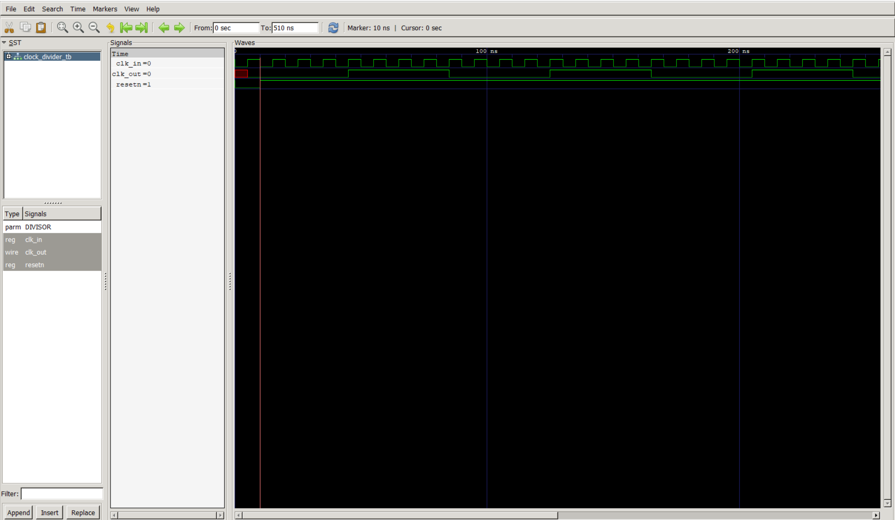

# Clock Divider Module
## 1. Purpose

The clock divider takes a fast reference clock and produces a slower derived clock, `clk_out`.

## 2. Interface

| Port      | Direction | Width | Description                                  |
|-----------|-----------|-------|-----------------------------------------------|
| `clk_in`  | input     | 1     | Fast reference clock                          |
| `resetn`  | input     | 1     | Active-low synchronous reset                  |
| `clk_out` | output    | 1     | Divided clock output                          |

**Parameter:** `DIVISOR` — sets the number of `clk_in` rising edges counted
before `clk_out` toggles. TThe `DIVISOR` N can be modified based on the formula to derive the required clock frequency:<br>
```math
 f_{out} = f_{in} / N
```
## 3.Architecture:

### Counter + Toggle

This is a toggle-based clock divider. A free-running counter counts
`clk_in` rising edges from `0` to `DIVISOR - 1`. On the edge where the
counter reaches `DIVISOR - 1`, two things happen simultaneously: the counter
resets to `0`, and `clk_out` inverts. This means `clk_out` flips state once
every `DIVISOR` input clock cycles.
The counter + toggle architecture can divide by any arbitrary number $N$ which proves to be a better alternative than the ripple counters that use cascading T-Flip Flops and can only divide by powers of 2. Moreover, they require less area, power, and its design is not very complex, hence the  choice of the architecture. The reset is **synchronous and active-low** — the design only reacts to reset
on a `posedge clk_in`. This design choice was made to avoid reset-removal metastability that can be introduced.

### Frequency math

Since `clk_out` toggles once every `DIVISOR` input cycles, a full output
period requires **two** toggles:

```
T_out (half period) = DIVISOR x T_in
T_out (full period)  = 2 x DIVISOR x T_in
f_out                 = f_in / (2 x DIVISOR)
```

For this project's testbench, `T_in = 10ns` and `DIVISOR = 4`:

```
T_out (full period) = 2 x 4 x 10ns = 80ns
f_out = f_in / 8
```

This is the number to check against measured waveform edges — it's the
ground truth for whatever self-checking assertions get added to the
testbench.

## 4. Testbench

`initial` sets the starting
value once, a separate `always #5` block toggles forever.

---
### NOTE: (JUST FOR DOCUMENTATION PURPOSE)
An earlier
draft mistakenly reset `clk_in` to `0` inside the toggle loop every
iteration, which produced zero-width glitches invisible in GTKWave but
still visible to the DUT's edge-triggered logic.

## 5. How to run

```bash
mkdir -p sim
iverilog -g2012 -o sim/clk_div.out rtl/clock_divider.sv tb/clock_divider_tb.sv
vvp sim/clk_div.out
gtkwave sim/clock_divider_tb.vcd
```

**Note:** the `sim/` directory must exist *before* running `vvp`, or the
`$dumpfile` call fails with `VCD Error: Unable to open ... for output` and
no waveform is produced..

## 6. Verification result

Simulated for 510ns. Waveform confirms:
- `clk_in` toggles cleanly at the expected 10ns period throughout.
- `resetn` is held low for the first 10ns, then released and stays high.
- `clk_out` remains held at `0` during reset, then begins toggling once
  reset releases, with measured period matching the predicted 80ns
  (`f_in / 8`).

     